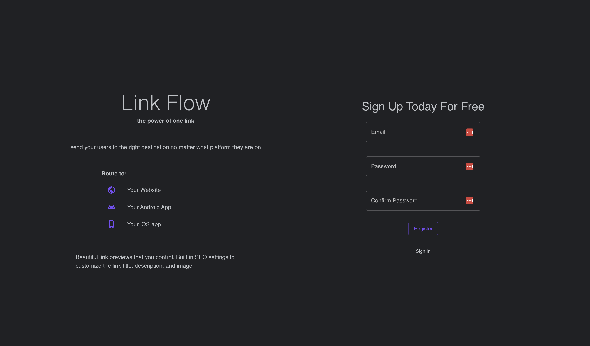
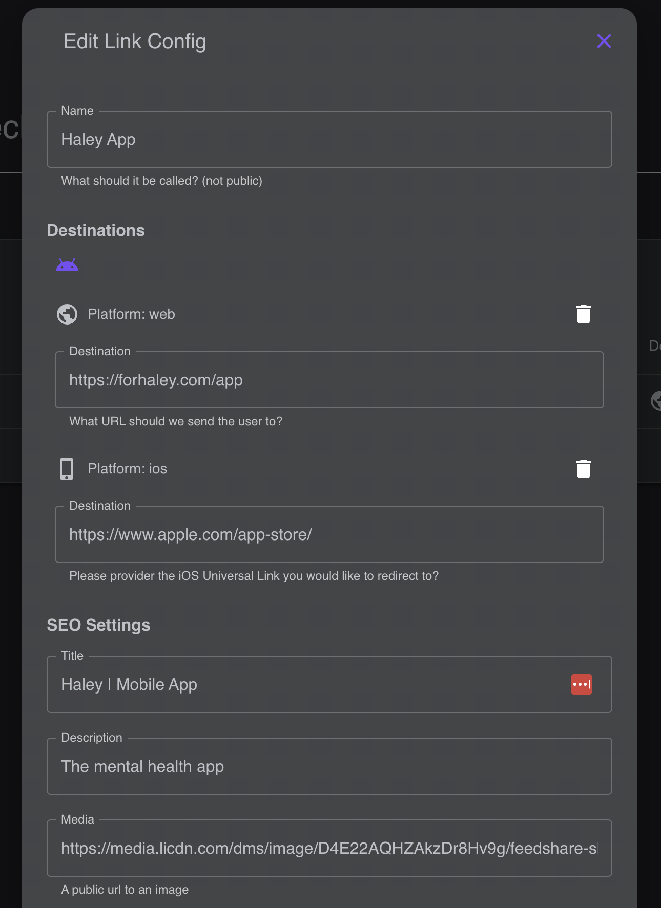

# Link Flow

Next.js service to provide deeps links that work across all platforms. Sign up for the demo [links.starktech.dev](https://links.starktech.dev)

Alternative to Firebase Dynamic Links which is now deprecated and set to shut down on August 25, 2025.






## Getting Started

First, run the development server:

```bash
npm run dev
# or
yarn dev
# or
pnpm dev
```

Open [http://localhost:3000](http://localhost:3000) with your browser to see the result.

## Resources

- [Next.js Documentation](https://nextjs.org/docs) - learn about Next.js features and API.
- [Learn Next.js](https://nextjs.org/learn) - an interactive Next.js tutorial.
- [API routes](https://nextjs.org/docs/api-routes/introduction)
